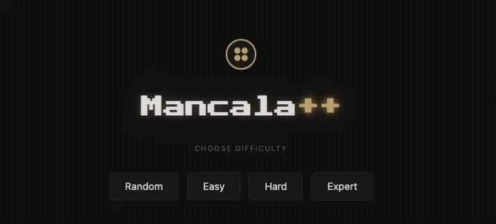

# AI Mancala

**[Live Demo](https://abhi6310.github.io/AI_Mancala).** Browser-playable Mancala built in React and deployed to GitHub Pages with no backend. Four AI difficulty levels from random play to alpha-beta pruning at depth 10, all running client-side and benchmarked across 100-game reproducible trials.



---

## Rules

Standard Mancala on a 6-pit board with 4 stones per pit. One rule variant: last stone landing in your own store does not grant an extra turn, keeping turn structure deterministic and the search tree tractable.

---

## Difficulty Levels

| Mode | Algorithm | Search Depth | Notes |
|---|---|---:|---|
| Random | Uniform random legal move | — | Baseline. Win rate ~45% against itself. |
| Easy | Minimax | 2 | Sees one exchange ahead. Misses multi-move setups. |
| Hard | Alpha-Beta | 5 | Avoids immediate captures, sets up stone chains. |
| Expert | Alpha-Beta | 10 | 99% win rate against random across 100 reproducible trials. |

Difficulty scales search depth, not a handicap.

---

## Benchmark Results

100 games per condition, fixed seed (`random.seed(109)`), AI as Player 1 against a random opponent.

### Win Rate by Algorithm and Depth

| Algorithm | Depth | P1 Wins | P2 Wins | Ties | Avg Turns | Avg Time/Game |
|---|---:|---:|---:|---:|---:|---:|
| Random vs Random | — | 45% | 51% | 4% | 45.8 | — |
| Minimax | 2 | 95% | 4% | 1% | 34.9 | 0.013 s |
| Minimax | 5 | 98% | 2% | 0% | 29.3 | 0.069 s |
| Alpha-Beta | 2 | 95% | 4% | 1% | 34.9 | 0.0008 s |
| Alpha-Beta | 5 | 98% | 2% | 0% | 29.3 | 0.018 s |
| Alpha-Beta | 10 | 99% | 1% | 0% | 28.4 | 2.211 s |

### Node Expansion at Depth 5

| Algorithm | Nodes Visited | Reduction |
|---|---:|---:|
| Minimax | 5,961 | — |
| Alpha-Beta | 1,438 | 75.9% |

Alpha-beta matches minimax move quality at depth 5 while visiting 75% fewer nodes, producing a 3.8x speedup.

### Extended Utility: Board Control Variant

Baseline: `P1_mancala - P2_mancala`

Extended: `(P1_mancala - P2_mancala) + 0.1 * (P1_pit_stones - P2_pit_stones)`

The 0.1 coefficient keeps stone differential dominant while rewarding board position; tested across values from 0.05 to 0.5.

| Depth | P1 Wins | Ties | Avg Turns | Avg Time/Game |
|---:|---:|---:|---:|---:|
| 2 | 96% | 1% | 37.3 | 0.011 s |
| 5 | 100% | 0% | 31.1 | 0.275 s |

---

## Implementation

Minimax performs a full DFS to a fixed depth, alternating max/min layers with game state copied per recursive call. Alpha-beta adds two pruning bounds: when `alpha >= beta`, the remaining subtree cannot change the root decision and is skipped. Move quality matches minimax at the same depth; node count does not. The utility function scores by stone differential in both stores, with an extended variant adding a weighted pit-stone term for board position.

---

## Tech Stack

**Frontend:** React 18, JavaScript, Vite, GitHub Pages

**Research:** Python 3, Jupyter Notebook

AI logic was developed and benchmarked in Python, then ported to JavaScript for client-side play.

**Requires:** Node 18+. No API keys or environment variables.

---

## Project Structure

```
src/
  engine/       game rules and AI algorithms
  components/   React UI
  styles/       CSS
notebook/       Python research and benchmarks
```

---

MIT License
